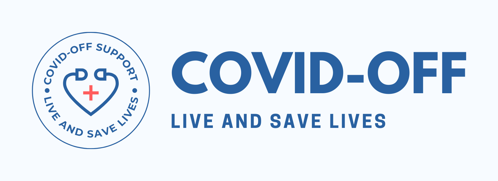

## Website: https://covidoff.live
## Data Resource Portal: https://covidoff.herokuapp.com
 

### The existing social problem in brief
> So many people are dying or suffering in this Pandemic due to failure at lead  generation. We are not able to view and solve our doubts and get confused under certain compelling circumstances in this Covid Pandemic. We need to get a portal that helps and manages all these things in the easiest way possible

### Target Citizen (Who will be benefited from your solution, mention that)
>Any family or lead who are being affected by the curse of Covid-19 and want to take help of medical resources or want to add their data to generate leads to increase the chances of getting connected to a donor or helper.

### Review of present systems to encounter the problem
> All the present systems use a system that is hard to break further to analyze and shows filtered data only.

### Shortcomings of the existing systems
> Due to availability of filtered data systems only, any supplier or NGOs is unable to see the whole data that is supplied in the portal.

### How your proposed system is different from others
> I have created a portal that not only serves as a resource collector and data finder but also attaches all the necessary resources that decreases the stress of connecting to too many websites to handle with their problem.

### Feasibility study of your proposed approach
> The Project is feasible but some shortcomings are there that we faced in the time of implementations. 
   - If someone is entering an errored Data Value, then there is no way for us to correct and estimate that.
   - We don’t have the resources to have a paid Cname Server or Hosting. We need to rely on GitHub and redirected hosting.
   - To make the project implementation easy, we followed Google Sheet API Custom WebScripting, So , we needed to add a separate portal to make the data accessible by the user.
   - The Website will have so many http requests as it follows a long path while working with the collected data and converting it to feasible and presentable data. So concurrent access will slow down the website a bit.

### Status of the data available on the internet for a similar project
> We collect data from the user only. And for building the website resources, we collected data from MHRD, Indian Govt. Covid Helpline and WHO. For State, District and City dynamic dropdown data, we collected the Data from the Local Directory Website for Indian States.
 
### How your approach will benefit society in the long run
> The website will work for any medical helpline even after covid with few tweaks. So it is made and built for the long run to help our target user.

### How cost-effective your system will be
> My system is cost effective as it still doesn't have any payment system or paid server as it’s datasheet is being managed in the Backend with Rest API, Google Drive API and Google Sheets API. In future, if we need to host a backend with a paid domain, it will still be less costly than other systems. In terms of users, the website will always be open source following GitHub’s MIT License. 

### A design draft of your system
> Ideation and flow: 	 https://docs.google.com/document/d/1uqXET7cZJINdwQ8m1ojUKv6TDGvEuoLYZKHQwOMD7Rc/edit?usp=sharing

### Technical skill required for developing such a system
> Tech Stacks Used:
  - **FrontEnd:** HTML, CSS, JS, Bootstrap, SCSS, Streamlit, JQuery
  - **Backend:** Streamlit, Python, PHP, Heroku-CLI, Ajax
  - **Database:** JSON, Gspread-dataframe, Openpyxl, Gspread
  - **Tools:** Git, GitHub, VSCode
  - **API:** Google Drive API, Google Sheet API, Twitter API
  - **Skills:** Software Development, Web Scraping, Python Web Scripting, FrontEnd, Responsive Design Building

### Resources required for your proposed project
> Medical Data, User resources
> Domain, Server, Streamlit Web Server Host Setup

### Any specific requirement for practical implementation of the same
> No, Data Resource and Computing and Development Resources are enough to build the same.

### Role of data mining in such a system
> Data Mining has a big role in the system as we have to clean and reconstruct the  data collected from users and need to generate certain data based id for reporting and managing the data.

### The knowledge you could gather by applying data mining in such a system
> How to convert a scratch dataset to a well constructed dataset that we can show in our portal as well as become interactive with the users.

### How that specific knowledge is beneficial for the society
> Collecting Data is no big deal. But processing the Data with Data Mining and showing the user the adjusted data is what makes a Project successful in the long run.

### How you plan to use that knowledge for social good
> We will collect  more such data and will impute those to make a better estimated dataset that may also help in future in medical dealing in such pandemic or critical situations.

### Conclusion
> This is the Portal for all the Data Resources. These resources are filled by general people. Verification at utmost level is not guaranteed. So, we are constantly trying to improve the data system and gather more knowledge in Data Mining. 
